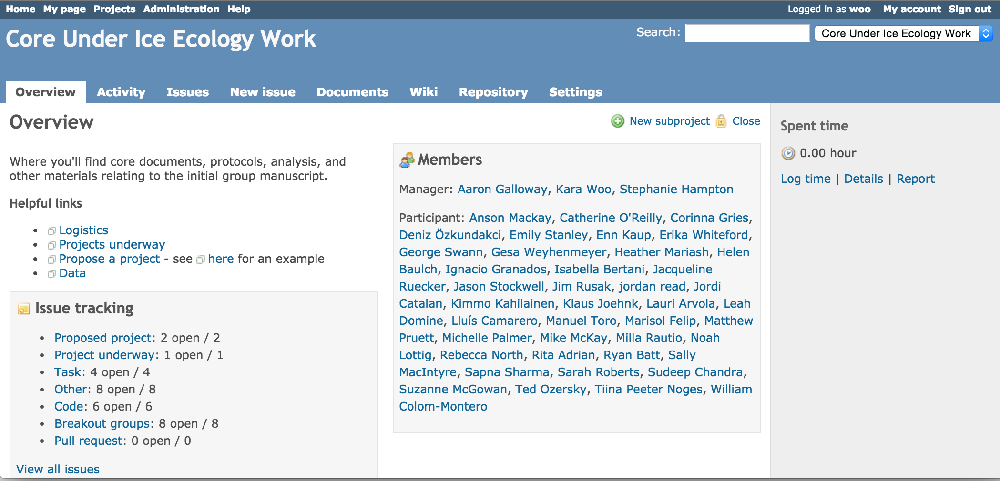

## Goals

1. Integrate data as seamlessly as possible
2. Encourage sharing

---

---

## Policies

* Document describing how data would be used and shared
* Internally to project collaborators first, then eventually public

--- .segue .dark

## Step 3: Validate Data

---

## R package `icetest`

https://github.com/karawoo/icetest

--- .segue .dark

## Step 4: Lots of Email

--- .segue .dark

## Step 5: The Fun Part

--- &twocol

## Workshop at NCEAS

*** =left

<a class="my-caption">Photos: Stephanie Hampton (left), NCEAS (right)</a>

*** =right

---

## Collaborative website

--- #custbgmap

## Lakes represented (so far)

---

## Conclusions

* Plan ahead
* Centralize communication
  * Email lists
  * Project website (Redmine, Open Science Framework, etc.)

