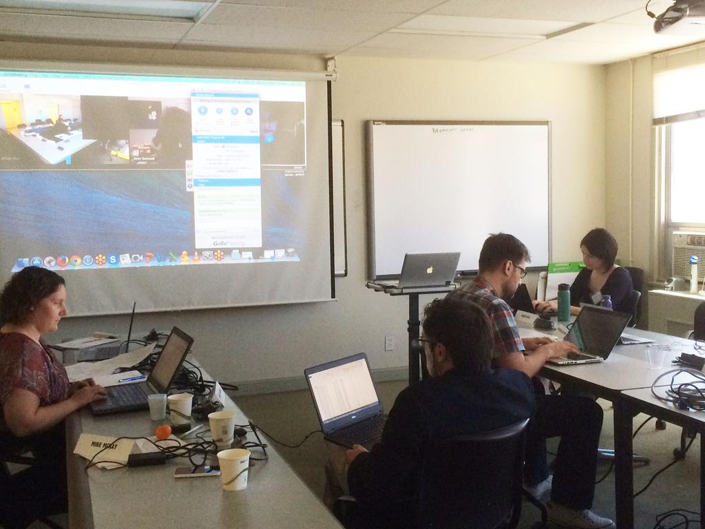
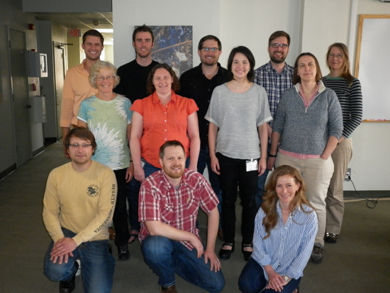

## Goals

1. Integrate data as seamlessly as possible
2. Encourage sharing
3. Use researchers' system-specific knowledge

---

---

## Policies

Document describing how data will be used and shared

Internally to collaborators first, then eventually public

--- .segue .dark

## Step 3: Validate Data

---

## R package `icetest`

https://github.com/karawoo/icetest

--- .segue .dark

## Step 4: Lots of Email

--- .segue .dark

## Step 5: The Fun Part

--- &twocol

## Workshop at NCEAS

*** =left

<a class="my-caption">Photos: Stephanie Hampton (left), NCEAS (right)</a>

*** =right

---

## Collaborative website

--- #custbgmap

## 86 lakes represented (so far)

--- &twocol

## Ice-off vs. ice-on chlorophyll-a

*** =left

 

*** =right

 

--- .segue .dark

## Conclusions

---

## Managing communications

* Be responsive
* Centralize communication

## Integrating heterogeneous data

* Plan ahead
* Validate the data

## Building community

* Be inclusive
* Communicate expectations early and often

---

## Acknowledgements

NSF DEB #1431428

Ice workshop steering committee: Emily Stanley, Ted Ozersky, Chris Polashenski

Matthew Pruett

National Center for Ecological Analysis and Synthesis

